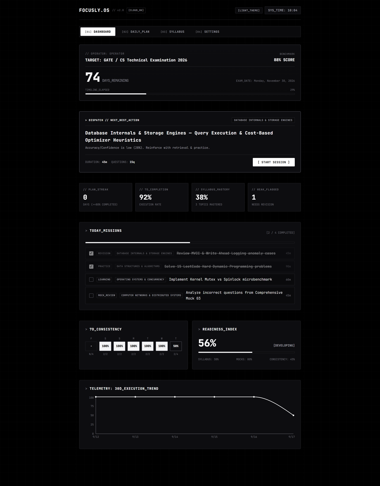
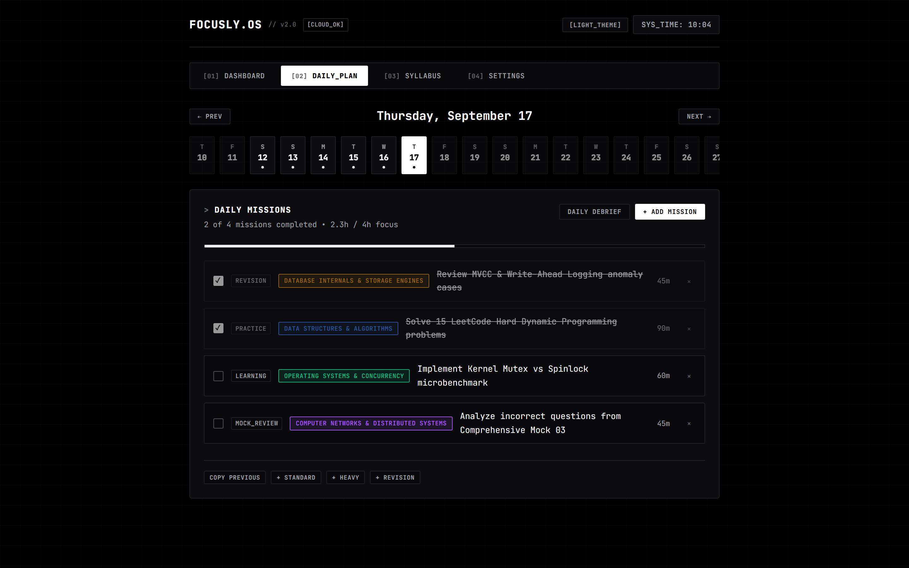
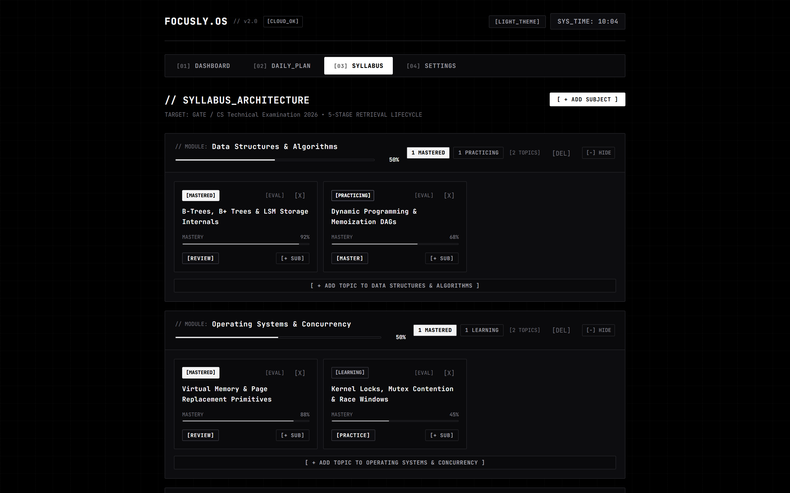
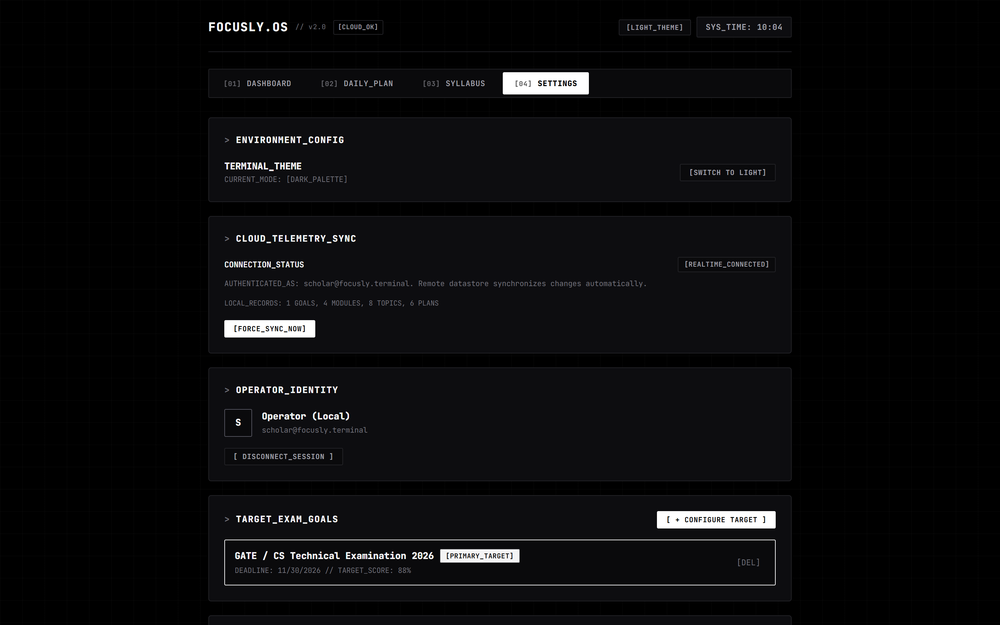
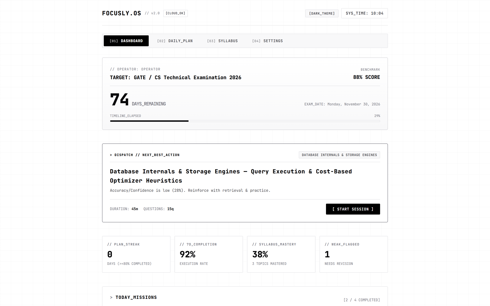

<div align="center">

# ⌘ FOCUSLY // EXAM OS
### PERSONAL EXAM COMMAND CENTER & SPACED REVISION ENGINE

[](https://react.dev/)
[](https://vitejs.dev/)
[](#-design-system)
[](https://firebase.google.com/)
[](LICENSE)

<br />

> **Focusly Exam OS** is an ultra-focused, distraction-free command center engineered for competitive examination preparation. Built upon cognitive science principles—active retrieval practice, spaced repetition heuristics, deterministic velocity telemetry, and mastery stage tracking—all wrapped in a stark, high-contrast monochrome terminal aesthetic.

<br />

<p align="center">
  
</p>

</div>

---

## ⚡ Key Highlights

- **🎯 Target Countdown & Velocity Engine** — Real-time countdown to target examination deadlines, elapsed preparation timeline, and daily target velocity telemetry.
- **🧠 Dispatch // Next-Best-Action Heuristic** — Automated recommendation engine determining the highest-leverage topic to review based on decay curves, weak confidence flags, and test error margins.
- **📈 Deterministic Readiness Index** — Composite exam readiness formula dynamically calculated from syllabus coverage (35%), mock test score trends (40%), and 30-day execution consistency (25%).
- **📋 Daily Missions Execution Board** — Granular daily task scheduling with categorized focus types (`LEARNING`, `PRACTICE`, `REVISION`, `MOCK_REVIEW`), planned vs. actual time tracking, and end-of-day reflection logging.
- **🌳 5-Stage Syllabus Architecture Tree** — Structured subject-to-topic-to-subtopic hierarchy with real-time mastery tracking (`NOT_STARTED` → `LEARNING` → `PRACTICING` → `MASTERED` / `WEAK`) and active retrieval confidence ratings.
- **📊 30-Day Execution Telemetry** — Interactive Recharts visual graphs rendering longitudinal consistency trends, 7-day completion matrices, and streak preservation.
- **🌓 Dual Terminal Aesthetics** — Pixel-perfect Pitch-Black Terminal default alongside a crisp Stark Paper White mode, powered by `JetBrains Mono`.
- **☁️ Cloud Sync & Zero-Config Offline Mode** — Instant Google Firebase Firestore synchronization across devices with transparent fallback to local cache and one-click demo session access.

---

## 🖥 Visual Walkthrough

### 01 // Command Center Dashboard
*Full telemetry overview displaying active countdown, next action dispatch, streak metrics, today's checklist, and 30-day execution curves.*

<p align="center">
  
</p>

---

### 02 // Daily Missions Execution Board
*Time-blocked preparation schedule with active task status toggles, subject color chips, duration budgets, and previous-day cloning.*

<p align="center">
  
</p>

---

### 03 // Hierarchical Syllabus Architecture
*Multi-tiered syllabus management with progress telemetry, topic confidence evaluation modal, and status lifecycle triggers.*

<p align="center">
  
</p>

---

### 04 // Telemetry & Configuration Gateway
*Session management, cloud datastore telemetry, exam goal parameters, and mock score log with percentile analytics.*

<p align="center">
  
</p>

---

### 05 // Stark Paper Light Theme
*High-contrast light monochrome theme optimized for daylight study sessions and paper-like aesthetic clarity.*

<p align="center">
  
</p>

---

## ⌨️ Global Keyboard Navigation

Focusly OS is built for keyboard-first workflow speed. Navigate the operating system without reaching for the mouse:

| Key Command | Action / Route | Description |
|:---:|:---|:---|
| <kbd>1</kbd> | `[01] DASHBOARD` | Switch to primary telemetry command center |
| <kbd>2</kbd> | `[02] DAILY_PLAN` | Open daily mission scheduler & time-blocking |
| <kbd>3</kbd> | `[03] SYLLABUS` | Inspect syllabus tree & topic mastery matrix |
| <kbd>4</kbd> | `[04] SETTINGS` | Open telemetry config, goals, & mock test ledger |
| <kbd>?</kbd> | `HELP // SHORTCUTS` | Toggle global keyboard shortcuts modal |

---

## 🏛 Architecture & Engineering

```
StudyTimer/
├── src/
│   ├── components/
│   │   ├── common/             # Sign-in gateway, shortcuts modal
│   │   ├── dashboard/          # Exam countdown, next action card
│   │   ├── layout/             # AppHeader with live clock, NavigationTabs
│   │   ├── plan/               # AddTaskModal, ReflectionModal
│   │   ├── settings/           # AddGoalModal, MockTestSection
│   │   └── syllabus/           # Subject & topic cards, confidence modal
│   ├── pages/
│   │   ├── DashboardPage.jsx   # Telemetry, readiness formula, trend charts
│   │   ├── PlanPage.jsx        # Daily mission planner, calendar scroller
│   │   ├── SyllabusPage.jsx    # Module tree, mastery cycle triggers
│   │   └── SettingsPage.jsx    # Goal targets, mock analytics, cloud status
│   ├── services/
│   │   ├── dataService.js      # Dual-layer Firestore cloud sync + local cache
│   │   └── recommendationEngine.js # Spaced retrieval next-best-action algorithm
│   ├── stores/                 # Zustand state slices (Auth, Exam, Plan, Mock, UI)
│   ├── utils/                  # Date helpers, ID generator, constants
│   ├── index.css               # Monochrome terminal design tokens & layouts
│   └── App.jsx                 # Main application router & listener hub
├── docs/
│   └── screenshots/            # Hi-res captures of all OS interfaces
└── vite.config.js              # Vite bundler configuration
```

### Readiness Index Formula
$$\text{Readiness} = 0.35 \times \text{Syllabus Mastery \%} + 0.40 \times \text{Mock Score Avg \%} + 0.25 \times \text{Consistency Score}$$

Where:
- $\text{Syllabus Mastery}$ is the percentage of syllabus topics in `MASTERED` state.
- $\text{Mock Score Avg}$ is the mean score percentage across registered simulations for the active goal.
- $\text{Consistency Score}$ is a weighted blend of 30-day plan creation frequency, daily mission completion rates, and active study streak.

---

## 🎨 Design System — Monochrome Terminal

```css
/* Core Terminal Design Tokens */
--bg-primary:      #000000;   /* Pitch black deep canvas */
--bg-secondary:    #0a0a0c;   /* Elevated command surface */
--bg-card:         #0d0d10;   /* Card frame */
--border:          #222226;   /* Subtle structural divider */
--border-accent:   #33333a;   /* Active / focused boundary */
--border-light:    #52525c;   /* High-contrast border */
--text-primary:    #f4f4f5;   /* Stark white typography */
--text-secondary:  #a1a1aa;   /* Secondary metadata */
--text-muted:      #71717a;   /* Dimmed terminal comments */
--font-mono:       'JetBrains Mono', monospace;
```

---

## 🚀 Getting Started

### Prerequisites
- [Node.js](https://nodejs.org/) `>= 18.0.0`
- [npm](https://www.npmjs.com/) `>= 9.0.0`

### Installation

```bash
# 1. Clone the repository
git clone https://github.com/Aspharier/StudyTimer.git
cd StudyTimer

# 2. Install dependencies
npm install

# 3. (Optional) Configure Firebase Cloud Datastore
cp .env.example .env
# Enter your Firebase configuration in .env if cross-device sync is desired

# 4. Start local development server
npm run dev
```

> **Note on Zero-Config Offline / Guest Mode**: Firebase credentials are completely optional. Clicking `[ ENTER OFFLINE / DEMO SESSION ]` at the access gateway activates the built-in offline engine with local storage caching and pre-populated sample exam preparation modules.

### Production Build

```bash
# Compile and optimize for production
npm run build

# Preview production build locally
npm run preview
```

---

## 🛠 Tech Stack

| Layer | Technology | Purpose |
|:---|:---|:---|
| **Core Framework** | React 19 | High-performance reactive UI rendering |
| **Tooling & Bundler** | Vite 8 | Instant HMR development server & production bundler |
| **State Management** | Zustand 5 | Atomic, subscription-based reactive stores |
| **Telemetry Visuals** | Recharts 3 | Responsive SVG line charts and telemetry graphs |
| **Cloud Database** | Firebase Firestore | Real-time multi-device cloud datastore & snapshot syncing |
| **Authentication** | Firebase Auth | Google OAuth provider integration |
| **Offline Cache** | Web Storage API (`localStorage`) | Zero-latency client persistence with batch reconciliation |
| **Typography** | JetBrains Mono & Inter | Precision monospace terminal typography |

---

## 📄 License

Distributed under the **MIT License**. See `LICENSE` for more information.

---

<div align="center">
  <sub>Engineered with precision for serious exam candidates by <a href="https://github.com/Aspharier">Aspharier</a>.</sub>
</div>
